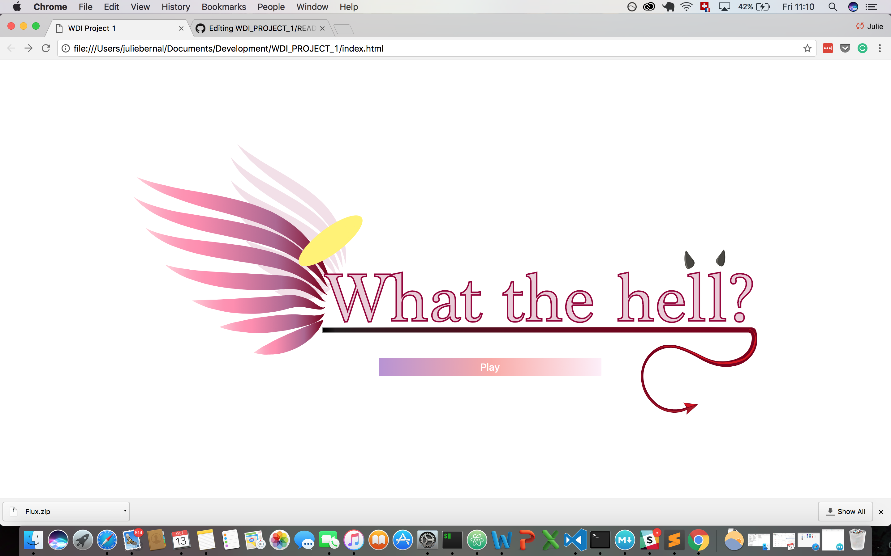
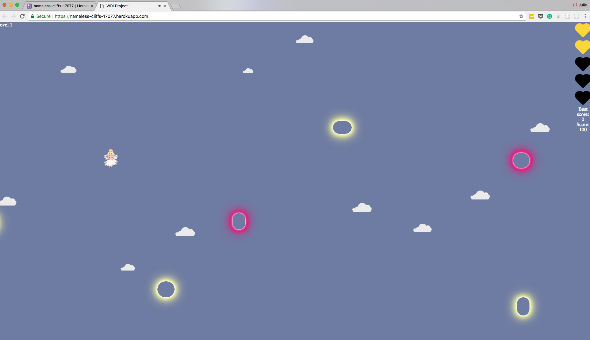
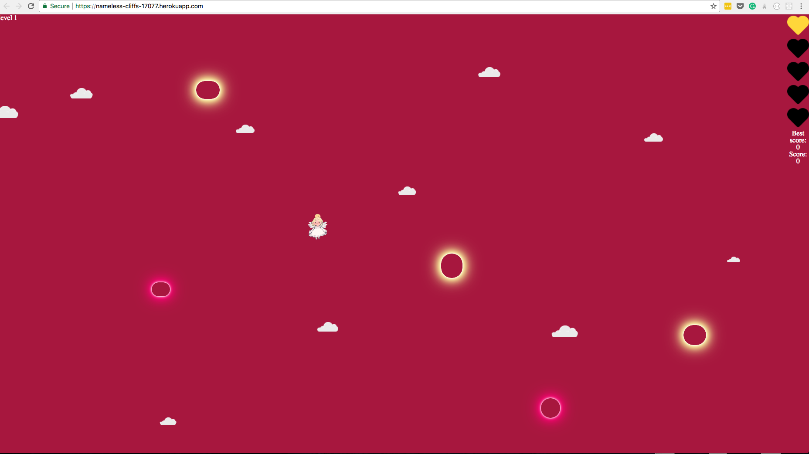
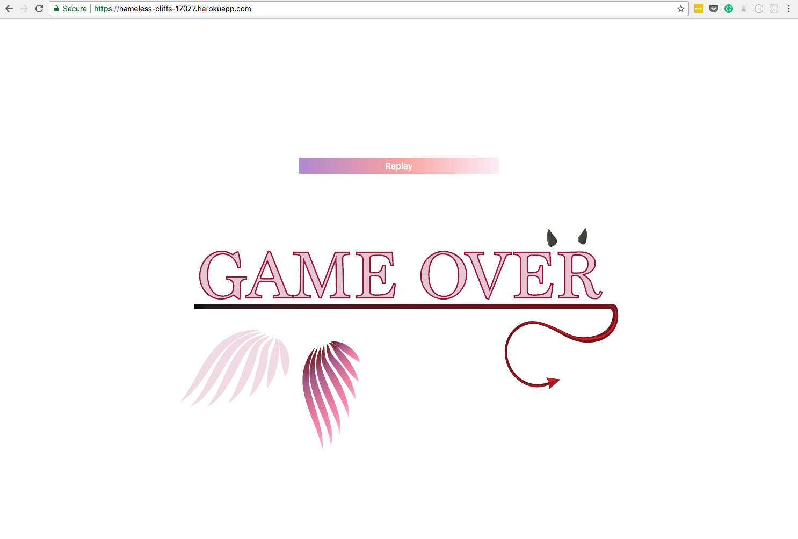

# WDI PROJECT 1

## GA WDI30 Project 1: 'What the hell?'

For my first project, I created a game called "What the hell?"  using Javascript, jQuery, HTML5 and CSS3. This was my first " big project" as a coder and it was really fun to build something from scratch and to solve the bugs to make it work. I always liked video games and it was really rewarding to make one myself.

## Why this project?

I wanted to experiment with collisions so I came up with a game base on collision where and angel is trying to find her way back to heaven by dodging clouds, collecting points and lives back. In order to win the player needs to survive 5 min. 

## Libraries / external stylesheets used

Animate.css
Reset.css
jQuery-ui
jQuery
Webpack

Game link: [https://nameless-cliffs-17077.herokuapp.com/ ]()

## Challenges:

At the beginning I was using CSS3 to create the clouds but their hit-box was changing which was creating problems with the collision as it was not staying around the clouds so sometimes the character would collide to an empty space. To Fix this problem I created the cloud animation with jQuery and use an image instead to keep a constant hit box. 

Another challenges was to get the collision working, My first intent would have certain area that would make the app crash so I had to play around until it was stable. 
Finally the spawn of the the different objects where difficult to manage so that the game was not too easy and not too hard.

## strenght:

Binding the characters movement to set keys and hitting the set target per day were definetely the strenght of this project. 

## for the future:

* I would like to set a parallax for the background to make it more engaging
* I also would like to finish the best score
* It would be interessting to have a second player join in the same screen and compete for the best score.
* Finally I would like to add more objects for the users to interact with
* I would also like to recreate this app with React to make it more current and build my own backend for it as well. 